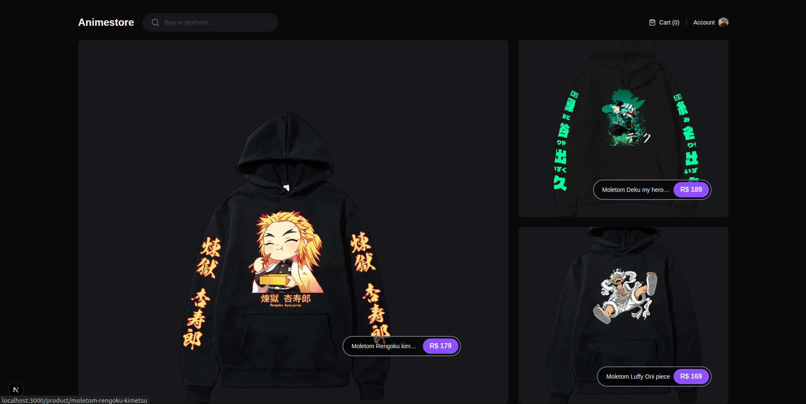
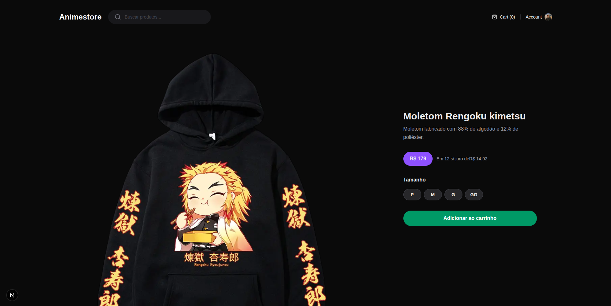
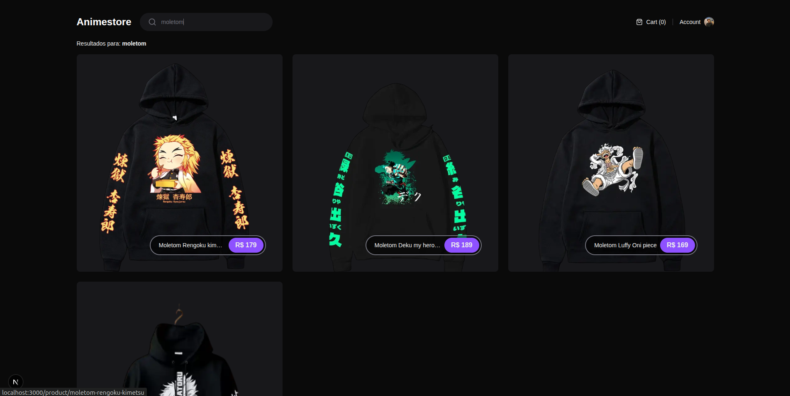
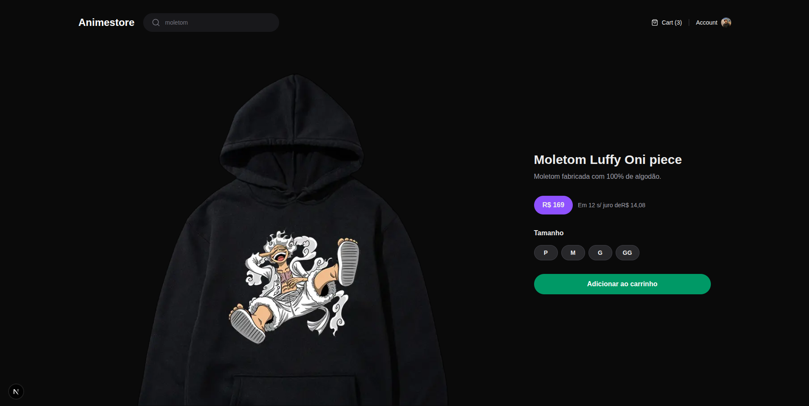

# 🛍️ Animestore

Projeto desenvolvido com base no **DevStore da Rocketseat**, com o objetivo de praticar conceitos modernos de desenvolvimento web utilizando o ecossistema React e Next.js.

---

## 🚀 Sobre o projeto

O **Animestore** é uma aplicação de e-commerce focada em aprendizado, simulando funcionalidades reais de uma loja online.

Neste projeto foram explorados conceitos importantes como:

* ⚡ Renderização com App Router
* 🔄 Server Components vs Client Components
* 🧠 Manipulação de estado e contexto
* 🔍 Sistema de busca com query params
* 🖼️ Geração de Open Graph Image dinâmica
* 📦 Consumo de API interna
* 🎨 Estilização com Tailwind CSS
* ⏳ Loading states com `loading.tsx`

---

## 🧪 Tecnologias utilizadas

* **Next.js**
* **React**
* **TypeScript**
* **Tailwind CSS**
* **Zod** (validação de ambiente)
* **Node.js**

---

## 📁 Estrutura do projeto

```bash
app/
  api/                # Rotas de API (backend)
  (store)/            # Rotas da aplicação
    home/
    search/
    product/
  components/         # Componentes reutilizáveis
  contexts/           # Context API (ex: carrinho)
  data/               # Mock de dados
```

---

## 🔍 Funcionalidades

* ✅ Listagem de produtos
* ✅ Página de produto dinâmica
* ✅ Busca de produtos por nome
* ✅ Skeleton loading durante carregamento
* ✅ Geração de imagens Open Graph dinâmicas
* ✅ Navegação otimizada com App Router

---

## ⚙️ Como rodar o projeto

### 1. Clone o repositório

```bash
git clone https://github.com/seu-usuario/devstore.git
```

### 2. Acesse a pasta

```bash
cd devstore
```

### 3. Instale as dependências

```bash
pnpm install
# ou
npm install
```

### 4. Configure o ambiente

Crie um arquivo `.env.local`:

```env
NEXT_PUBLIC_API_BASE_URL=http://localhost:3000
APP_URL=http://localhost:3000
```

### 5. Rode o projeto

```bash
pnpm dev
# ou
npm run dev
```

---

## 🌐 Rotas importantes

* `/` → Página inicial
* `/product/[slug]` → Produto
* `/search?q=nome` → Busca
* `/api/products` → API

---

## 🧠 Aprendizados

Durante o desenvolvimento deste projeto, foram praticados:

* Organização de projeto com App Router
* Uso de rotas dinâmicas
* Tratamento de erros e validações
* Boas práticas com TypeScript
* Integração entre frontend e backend no Next.js

---

## 📸 Preview

* Tela home do projeto

> 

* Tela de Infomormações do Produto

>  

* Tela de Busca dos Produtos

> 

* Movimentacao na quantidade de produtos no carrinho

> 


---

## 📌 Observações

Este projeto tem fins educacionais e foi inspirado no conteúdo da Rocketseat.

---

## 👨‍💻 Autor

Feito por **Diovan Baptista** 🚀
